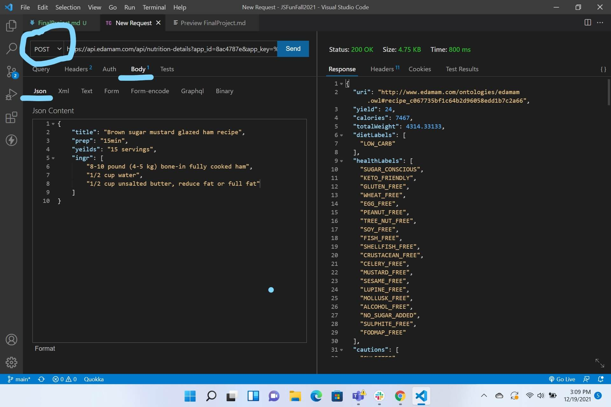
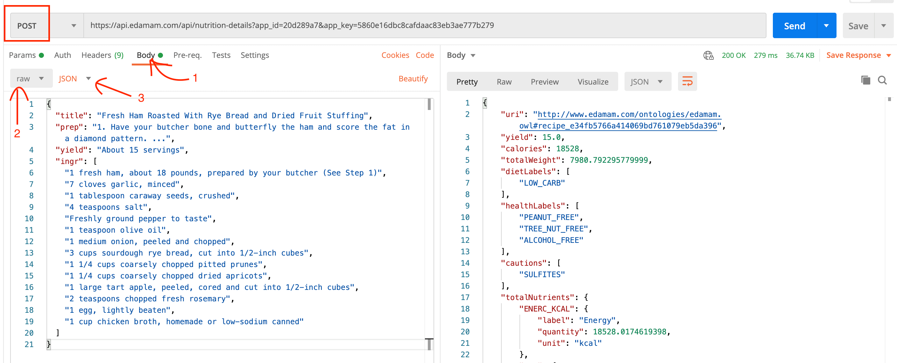
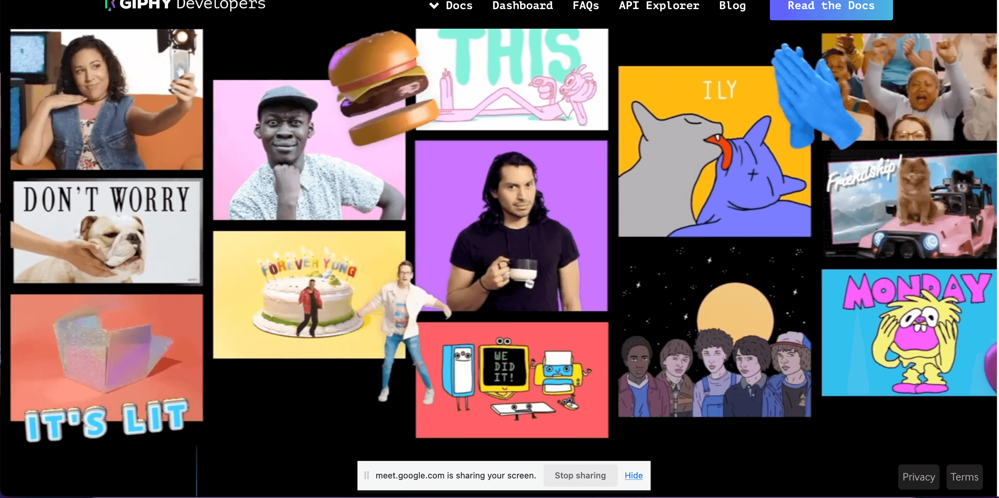

# Final Project - APIs

**Due Date: May 29, 2024 11:59pm**

For your final project, you will be leverage an API (or APIs) to display dynamic content onto a webpage. You will choose between one of these ideas below, or come up with your own idea that uses a public API.

1. A Movie Website
2. A Nutrition Website
3. Giphy CRUD App
4. Your Own Idea

## Project Goals

- To put together and make practical use of what was taught in class.
- To learn about developer practices, like setting up a new website, maintaining your own git repository and writing a _README.md_.
- To build a portfolio piece to show off to potential employers.

This project will put together these topics that were covered in class:

- Fundamentals of JavaScript
- AJAX and HTTP(s) requests
- Working with the DOM and events

## Project Requirements

You must meet these requirements in order to pass.

- You should host a demo of your project. (See "Github Repository and Pages" below.)
- Your website should not crash at any point.
- There shouldn't be any major bugs.
- Your project must make at least two asynchronous API calls.
- You must use an asynchronous library in a style that we covered in class (async & await and/or promises).
- You should display the data returned from an API on the user's screen in some fashion. For example, your API could return the name and image URLs of social media followers of a given person. You could then display the name and avatar of each follower on the page.
- You must handle two or more events.
- You must handle user input somewhere within the project. For example, handle a search engine or display text that the user typed somewhere on the screen.
- Your code should not contain `var`.
- You write your JavaScript code in external JavaScript files. If you use a `<script>` tags, all JavaScript code should be enclosed within an Immediately Invoked Functional Expression (IIFE). (See "Structuring Your Project" below.)

## Structuring Your Project

Here are three ways you can structure your project into different files:

1. Loading files with `<script>` (the oldest and simplest way)
2. Using ESM modules with a bundler
3. [Using ESM modules with the `<script>` tag](examples/esm/README.md)

You can put your code in file(s) external to the HTML that are loaded with `<script>` tags, like this:

```html
<!DOCTYPE html>
<html lang="en">
  <head>
    <!-- ... -->
    <script src="https://code.jquery.com/jquery-3.5.1.min.js" defer></script>
    <script
      src="https://cdn.jsdelivr.net/npm/lodash@4.17.20/lodash.min.js"
      defer
    ></script>
    <!-- Loading 3rd party libraries like AXIOS -->
    <!-- Look for "CDN" in the documentation -->
    <script src="https://cdn.jsdelivr.net/npm/axios/dist/axios.min.js"></script>

    <!-- Your code -->
    <script src="js/utils.js" defer></script>
    <script src="js/log.js" defer></script>
    <script src="js/dom.js" defer></script>
    <script src="js/app.js" defer></script>
  </head>
  <body>
    <!-- ... -->
  </body>
</html>
```

**In order for the site to work with Github Pages, your main HTML file must be called "index.html" and it must be in the root of you project.** (That means it cannot be inside of a folder in your project.) For more on Github Pages, see "Github Repository and Pages" below.

If you do it this way, you will want to include any third party libraries like Axios using a `<script>` tag. The library's documentation will probably give you instructions on how to install with NPM. Ignore these instructions. Instead, look for the words "CDN" in the documentation. If it isn't in the documentation, then you can usually find one by Googling "CDN" and the library's name.

You can share code between JavaScript files by attaching your code to the window like this:

```javascript
// Wrap in Immediately Invoked Functional Express (IIFE) to protect your code
(function () {
  const toTitleCase = (str) => {
    return str.replace(/\w\S*/g, function (txt) {
      return txt.charAt(0).toUpperCase() + txt.substr(1).toLowerCase();
    });
  };

  // Attach what you need to share between files to the window
  window.toTitleCase = toTitleCase;
})();
```

Alternatively, you can use ES6 modules with a bundlers like [Vite](https://vitejs.dev/), [Webpack](https://webpack.js.org/), or [Parcel.js](https://parceljs.org/). With bundlers, you can install JavaScript libraries like Axios with NPM. If you're goal is to be a JavaScript developer, using these tools will make a better portfolio piece. However, they can take considerably more time to get started. If you want to use bundlers, please be realistic with how much time you have to complete the project.

## Using APIs

### CORS

Another thing to note is that you can run into Cross-Origin Resource Sharing (CORS) issues with some APIs. (Sometimes this happens because you are developing things locally and you are using HTTP instead of HTTPS). You know will know that you are experiencing a CORS issue when you see an errors like this in your browser's console:

```
Access to XMLHttpRequest at 'https://api.yelp.com/v3/businesses/search?term=delis&latitude=37.786882&longitude=-122.399972' from origin 'null' has been blocked by CORS policy: Response to preflight request doesn't pass access control check: No 'Access-Control-Allow-Origin' header is present on the requested resource.
spread.js:25 Uncaught (in promise) Error: Network Error
    at e.exports (spread.js:25)
    at XMLHttpRequest.d.onerror (spread.js:25)
```

Test your API out in the Chrome, Firefox, Safari, Edge or another web browser before committing to an API. An API request may work fine with Thunder Client or Postman, but not in a web browser.

[You can read more about CORS here](https://developer.mozilla.org/en-US/docs/Web/HTTP/CORS).

### Registering and API Keys

For your project, you will need to use at least one API. Most APIs require that you register with them. You will have to signup and create an account. In return, you will typically get an API key, which you will need to include within your API AJAX request. How to do this can vary from API to API. You must read the API documentation to learn how to make requests, as this is a part of being a web developer.

For security reasons, you would normally store your API key in a separate file and and add the file to your _.gitignore_ so that it is not committed to git. However, since this is a portfolio piece, you might want to include your API in git repository anyways. Please note that if you do this, you are likely to get a security alert from Github. Employers may clone and repository and test out your project. Leave instructions in the _README.md_ on how to register for your API and include the API key in the project.

### Rate Limits

Please note that APIs often have rate limits. This means that they will block you after you make several requests within a day (usually around 1000 on the free tier). If the user will be making a search request, it is a good idea to [debounce](https://www.npmjs.com/package/debounce) the request, so that you or your users do not reach the quota.

## Project Ideas

You can pick one of the following ideas, or come up with one on your own. These are open-ended ideas. We are giving you a lot of room to be creative, as long as your project meets the project requirements and is presentable to employers.

### 1. Create a Movie Website with the Movie DB API

Develop a movie website like iMDB or [The Movie DB](https://www.themoviedb.org/). Some of the things you can do is have a movie search page, display what movies are now playing, display the top rated movies, or display details about a single movie.

The Movie DB [provides three different movie APIs](https://www.themoviedb.org/documentation/api). You can [read the documentation on how to get started here](https://developers.themoviedb.org/3/getting-started/introduction). In order to use these APIs, you must [signup](https://www.themoviedb.org/signup). You will then receive an API key. You will need to include the API key in the end of the URL of every AJAX request as a GET parameter. For example, to search for movies called _Frozen_, you would use this URL, replacing `API_KEY` with your API key.

```
https://api.themoviedb.org/3/search/movie?api_key=API_KEY&language=en-US&query=Frozen&page=1&include_adult=false
```

Note that you will need to substitute spaces with _%20_. So if you were searching for the movie _Frozen 2_, you would plugin _Frozen%202_ like this:

```
https://api.themoviedb.org/3/search/movie?api_key=API_KEY&language=en-US&query=Frozen%202&page=1&include_adult=false
```

You can use the ID of a movie returned in the results of the [Search](https://developers.themoviedb.org/3/search/search-movies) or [Discover](https://developers.themoviedb.org/3/discover/movie-discover) API to then look up a specific movie with the [Find API](https://developers.themoviedb.org/3/find/find-by-id).

Please note that the movie APIs do not send back the full image URL in the results. You will need to start the URL with `https://image.tmdb.org/t/p/w500/`. For example, if you get this response ...

```json
"results": [
  {
      "poster_path": "/qdfARIhgpgZOBh3vfNhWS4hmSo3.jpg",
      "original_title": "Frozen II",
      "title": "Frozen II",
      // ...
  },
  // ...
```

... the image URL should actually be `https://image.tmdb.org/t/p/w500/qdfARIhgpgZOBh3vfNhWS4hmSo3.jpg`. For more information, see the [documentation on images](https://developers.themoviedb.org/3/getting-started/images).

The Movie DB APIs have an option to filter out adult content. Your project will be presented to employers, so please read the documentation and use the adult filters.

### 2. Create a Nutrition Website with the Edamam API

Create a nutrition website. For example, users could search for different foods or you could have a predetermined list of meals. Your site can display the nutritional information of whatever the user clicks on.

Edamam provides three different APIs: a [Nutrition Analysis API](https://developer.edamam.com/edamam-docs-nutrition-api), a [Recipe Search API](https://developer.edamam.com/edamam-docs-recipe-api) and a [Food Database API](https://developer.edamam.com/food-database-api-docs). You will have to [signup for an api](https://developer.edamam.com/). Choose the "Developer" plan, which is free. Each API will have its own APP ID and API key. To retrieve or generate an API key:

1. [Login to the Edamam website](https://developer.edamam.com/login). (You may not receive a confirmation email. You can login right after signing up.)
2. Click on the "Dashboard" button in the upper right.
3. Click on the "Applications" tab in the main menu.

From here, you can click on the "View" button to retrieve your APP ID and API key. You can also click on the "Create a new application" if you would like to use a different API.

You will need to include the APP ID and API Key, as well as any GET parameters, in the URL itself. For example, say you are searching for chicken with the Recipe Search API. You would make a request to this URL, plugging in `APP_ID` and `API_KEY` with your credentials.

```
https://api.edamam.com/search?q=chicken&app_id=APP_ID&app_key=API_KEY
```

Note that you will need to substitute spaces with _%20_. For example, if you are looking up the nutritional value of a red apple using the Nutrition API, you would plugin _red%20apple_ into the URL like this:

```
https://api.edamam.com/api/food-database/v2/parser?ingr=red%20apple&app_id=APP_ID&app_key=API_KEY
```

The Nutrition Analysis API is different from the other Edamam APIs because it is a POST request. You must include the header `"Content-Type": "application/json"` and you must send it JSON. To test this API in Thunder Client and Postman, you must send JSON like this:





### 3. GIF Collection Manager with GIPHY API



Create a web app that allows users to manage their GIF collection using the GIPHY API. Users will be able to add, view, edit, and delete GIFs in their collection.

GIPHY provides a powerful [API](https://developers.giphy.com/docs/api/) for developers to interact with their platform. You will have to [signup](https://developers.giphy.com/dashboard/) for an API key to access GIPHY's API features. Choose "API" instead of "SDK". Your platform is "Web".

#### Project Requirements

If you choose this project, in addition to the requirements above, your project must also include the following features:

1. Add new GIFs to the collection by entering a title and a URL.
2. View a list of all GIFs in the collection.
3. Edit the title and/or URL of an existing GIF in the collection.
4. Delete a GIF from the collection.
5. Display error messages when something goes wrong.
6. Integration with the GIPHY API.
7. Authentication with the GIPHY API using an API key.
8. Create new GIFs using the GIPHY API's "create" endpoint.
9. Retrieve a list of all GIFs using the GIPHY API's "search" endpoint.

#### Example API Requests

Replace `API_KEY` with your actual API key in the following examples:

```
https://api.giphy.com/v1/gifs/search?api_key=API_KEY&q=funny&limit=25&offset=0&rating=g&lang=en
```

##### Search GIFs

Replace `API_KEY` with your actual API key in the following examples:

```
https://api.giphy.com/v1/gifs/search?api_key=API_KEY&q=funny&limit=25&offset=0&rating=g&lang=en
```

##### Update and Delete

Updating and deleting GIFs are not supported by the GIPHY API as the uploaded GIFs become part of the GIPHY platform. However, you can manage the updates and deletions within your app's collection.

##### API Documentation

For more information, refer to the [Giphy API](https://developers.giphy.com/docs/api/).

For more examples, refer to the [Giphy Explorer](https://developers.giphy.com/explorer/).

### 4. Your Own Idea

You are free to pursue another project idea, as long as it:

- Meets the project requirements
- You use at least one API. (You can browse [AnyAPI](https://any-api.com/), [RapidAPI](https://rapidapi.com/hub) or these [public APIs](https://github.com/public-apis/public-apis) to discover other APIs.)
- You are able to realistically complete the project or at least have something presentable to employers by the deadline.

Please let Jamal and Matina known by **May 19**. You must emails them and provide them with your API's documentation. If they do not approve of your project, you will have to work with one of the suggested ideas above.

## Github Repository and Pages

You will need to [create a new public Github repository](https://help.github.com/en/articles/create-a-repo) for this project. It must be public. You should also include a _README.md_ and _.gitignore_ file.

Your _README.md_ file should be written in [Markdown](https://github.com/adam-p/markdown-here/wiki/Markdown-Cheatsheet). This should be written for employers who may be looking at your work. Describe your project and explain how to get started. You can find an example template of a _README.MD_ here:
https://github.com/othneildrew/Best-README-Template

You can generate _.gitignore_ file with [gitignore.io](https://www.toptal.com/developers/gitignore). If you have a _node_modules_ folder, be sure to include it in your _.gitignore_.

In addition to submitting code, you will need to submit a hosted version of your project. An easy way to do this is to publish your project with Github pages. Here are the steps:

1. Open you Github repository e.g. https://github.com/my-github-username/final-project for your project in a web browser.
2. Click on the "Settings" tab below the "Unwatch", "Star", and "Fork" buttons.
3. In the sidebar, click on "Pages".
4. Underneath where it says "Source", click on the "Branch" dropdown and select "main".
5. Hit the "Save" button.
6. You will see the URL for your published project (e.g. https://my-github-username.github.io/final-project), but it may take up to 15 minutes before the link works. If you click on the link and click a page not found error, you can try opening it an Incognito window or another browser.

In the future, if you want to deploy any changes to your website:

1. Commit all of your changes
2. Run `git push origin main`

Then it should take a little a minute for the changes to go into effect.

## Project Design

We realize that we did not teach design in this class, but there is no way to get around the fact that design must be a part of the process. We will not grade your project on how good it looks, but a good design will make a better impression with employers, so please try to make your application look as nice as possible.

## Code Quality

While you will not fail if you do not meet these quality requirements, we will ask you to resubmit your work if it is not up to a professional standard. One of the goals of this project is to help you build a portfolio. Just like an interviewer will judge you on your attire, employers will judge you on the neatness of your code.

- You should have _README.md_ written in Markdown. It should explain the purpose of the project, describe how to play the game, give instructions on how to install and start your project and credit yourself as the author. Here are some resources on creating _README.md_ files:
  - [Make a README](https://www.makeareadme.com/)
  - [Markdown cheatsheet](https://github.com/adam-p/markdown-here/wiki/Markdown-Cheatsheet)
- Add anything that should not be committed to your _.gitigore_ file. If applicable, the _node_modules_ folder should be ignored.
- Choose descriptive and specific names for variables, constants, functions and anything else that is named.
- You must not leave any debugging statements in your code. This means when you commit your code, remove any `console.log` statements.
- Only have actual comments within comment tags. Do not commit code that you commented out for debugging purposes.
- No errors should appear in the console.
- Remove any code that is not being used. (This affects application load time as well as code quality.)
- Use proper indentation. (Prettier can take care of this.)

## Project Submission

To submit your project, you will need to email the following to Jamal (jamal@albancancode.org) and Matina (matina@albanycancode.org):

1. The link to your Github repository.
2. The link to you where your project is published. You can publish your project with Github Pages or you can a different hosting service.

Your project does not have to be 100% complete, but it does have to be presentable to employers.

## Project Help

If you need help, please schedule a 1-on-1 with your instructors or any of the CanCode Communities staff who is available to help.
